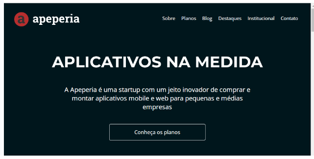

# Apeperia Alura : Arquivos do projeto para a Apeperia

 

<h1>Descrição da pagina</h1>

<h4 align="center"> 
    :construction_worker:  Projeto em desenvolvimento  :construction:
</h4>

 Modulo do programa One, sobre layout responsivo.

## :bookmark_tabs: Proposta:

<li>- Entender o processo de desenvolvimento de páginas web;</li>
<li>- Conheçer o Emmet, ferramenta para agilizar a escrita de códigos;</li>
<li>- Melhorar a manutenção de códigos com variáveis CSS;</li>
<li>- Escrever códigos semânticos que ajudam na acessibilidade e SEO;</li>
<li>- O resultado deve ser exibido na tela;</li>
<li>- Aprender a lidar com adaptação de diferentes layouts;</li>
<li>- Aprimore seu conhecimento de responsividade. </li>

## 📁 Acesso a pagina

:link: <a href="https://amandaafernandes.github.io/Apeperia_Alura-Layout_Responsivo/"> Link da Apeperia </a> (pagina estática). 

## :computer: Ferramentas e Tecnologias utilizadas:
<li>Javascript;</li> 
<li>HTML5;</li>
<li>CSS 3;</li>
<li>Git e Guithub.</li>
(trilha front end - Programa One de Alura + Oracle).
